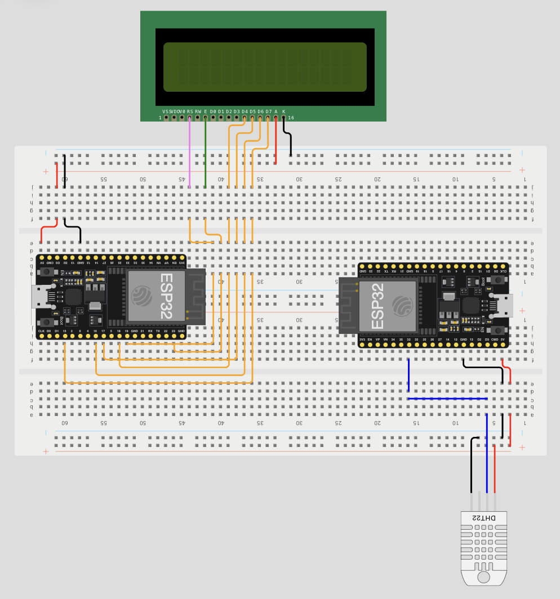

# SkyVault

## Sommaire

- [SkyVault](#SkyVault)
  - [I- Installation de la solution](#i-installation-de-la-solution)
    - [A. Set Up Raspberry](#a-set-up-raspberry)
    - [B. Set Up ESP32](#b-set-up-esp32)
    - [C. Set Up Webrepl](#c-set-up-webrepl)
    - [D. Set Up Firebase](#d-set-up-firebase)

# I. Installation de la solution

1- Clonné ce répository

2- Suivre ce schéma de montage 

### A. Set up raspberry
- **Préparation de l'os** : installation de Raspbery pi os [here](https://www.raspberrypi.com/software/). Renommer l'hostname de la machine en skyvault.local        

- **Installation de docker et docker compose** : 
```
curl -fsSL https://get.docker.com -o get-docker.sh
sudo sh ./get-docker.sh --dry-run
```
- **Importe docker compose** : Récupérer le docker-compose.yml dans le dossier MQTT. Excuter la commande ``` docker compose up ```

### B. Set Up ESP32
- **Sur l'esp32 publisher** :
  - Ajouter le script esp32_pub.py dans l'esp32 (fichier dans le dossier MQTT)
  - Ajouter la ligne ```import esp32_pub``` dans le fichier boot.py de l'esp32

- **Sur l'esp32 subscriber** :
  - Ajouter le script esp32_pub.py dans l'esp32 (fichier dans le dossier MQTT)
  - Ajouter la ligne ```import esp32_sub``` dans le fichier boot.py de l'esp32
  - Ajouter les fichier **esp32_gpio_lcd.py** et **lcd_api.py** dans l'esp32 (fichier dans le dossier library)

### C. Set Up Webrepl

- **Sur l'esp32 publisher** :
  - Connectez-vous a l'esp32
  - Dans l'interpreteur de command thonny ide utilisez cette commande : ```import webrepl_setup```
  - Definissez un mot de passe
  - Maintenant suivez ce [tuto](https://bhave.sh/micropython-webrepl-thonny/)

> :speech_balloon:
> L'adresse IP est statique c'est: 192.168.234.96
> N'oubliez pas de mettre votre mot de passe

- **Sur l'esp32 subscriber** :
  - Connectez-vous a l'esp32
  - Dans l'interpreteur de command thonny ide utilisez cette commande : ```import webrepl_setup```
  - Definissez un mot de passe
  - Maintenant suivez ce [tuto](https://bhave.sh/micropython-webrepl-thonny/)

> :speech_balloon:
> L'adresse IP est statique c'est: 192.168.234.222
> N'oubliez pas de mettre votre mot de passe

### D. Set Up Firebase
- **Lancer les commande suivante sur votre odinateur**: 

```bash
cd MQTTtoFirebase/
npm run install
```

